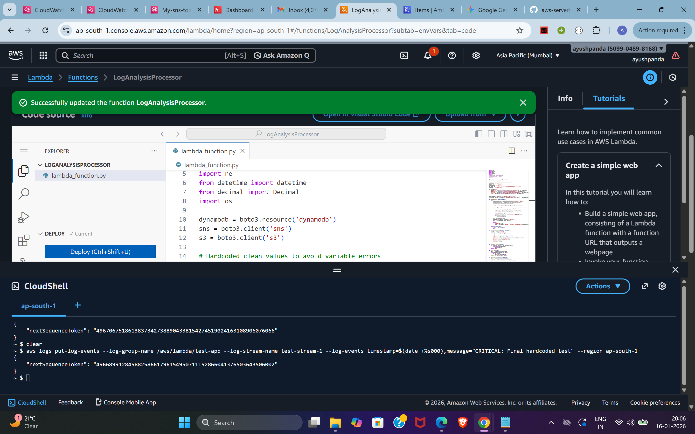
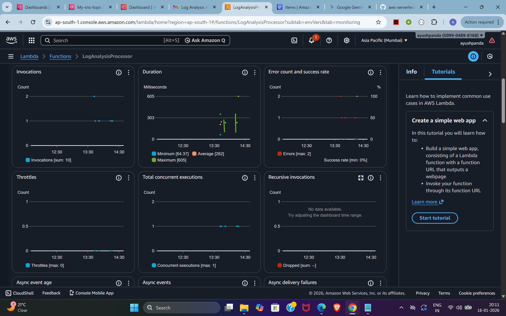
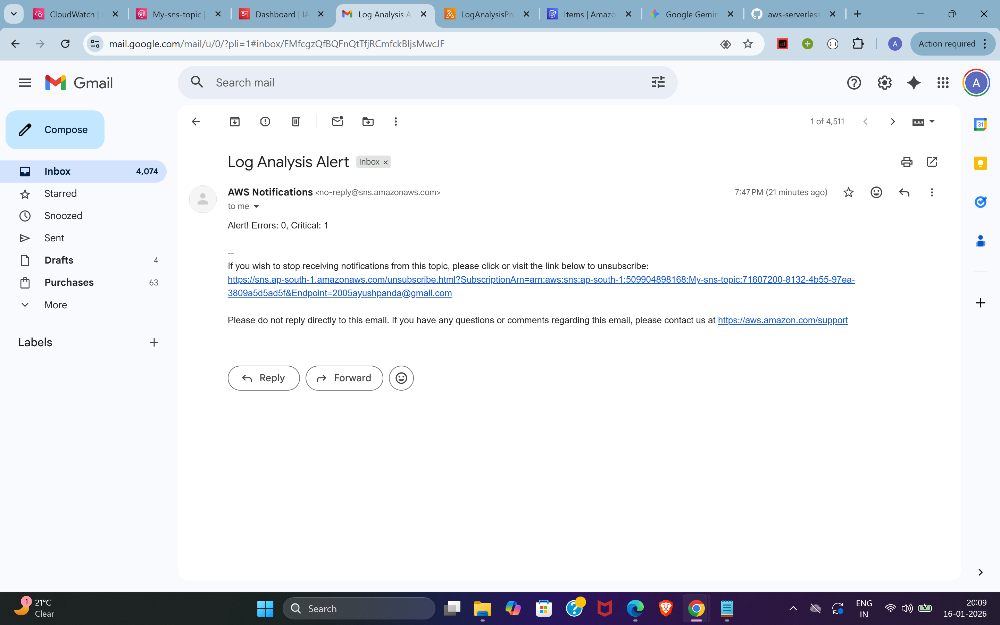
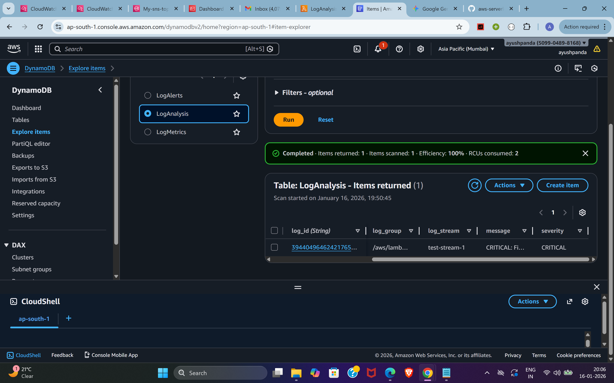

# AWS Serverless Log Analysis & Alerting Pipeline

## 📌 Project Overview
An event-driven cloud monitoring system that ingests system logs, identifies critical failures using pattern matching, and triggers automated responses (database logging and email alerts).

## 🏗️ Architecture
- **Source:** AWS CloudWatch Logs
- **Compute:** AWS Lambda (Python 3.x)
- **Database:** Amazon DynamoDB (NoSQL)
- **Alerting:** Amazon SNS (Simple Notification Service)
- **Archive:** Amazon S3

## 🛠️ Features
- **Real-time Processing:** Uses CloudWatch Subscription Filters to trigger Lambda instantly.
- **Pattern Matching:** Python logic filters for "CRITICAL" keywords.
- **Data Persistence:** Stores structured log metadata in DynamoDB.
- **Automated Notifications:** Sends immediate email alerts via SNS for high-priority incidents.

## 🚀 How it Works (Input -> Output)
1. **Input:** A log event is generated (simulated via AWS CLI).
2. **Process:** Lambda decodes the GZIP/Base64 CloudWatch data.
3. **Storage:** Log details are saved to the `LogAnalysis` table.
4. **Output:** If "CRITICAL" is detected, an alert is sent to a confirmed email subscription.

### 🚀 Proof of Work

#### 1. Input: Simulated Log via CLI

#### 2. Process: Lambda Execution Logs

#### 3. Output: Real-time Email Alert

#### 4. Storage: DynamoDB Entries

